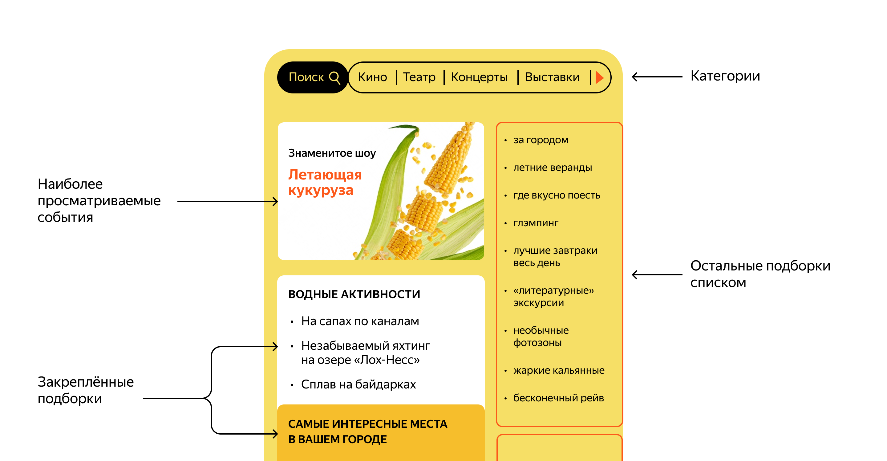
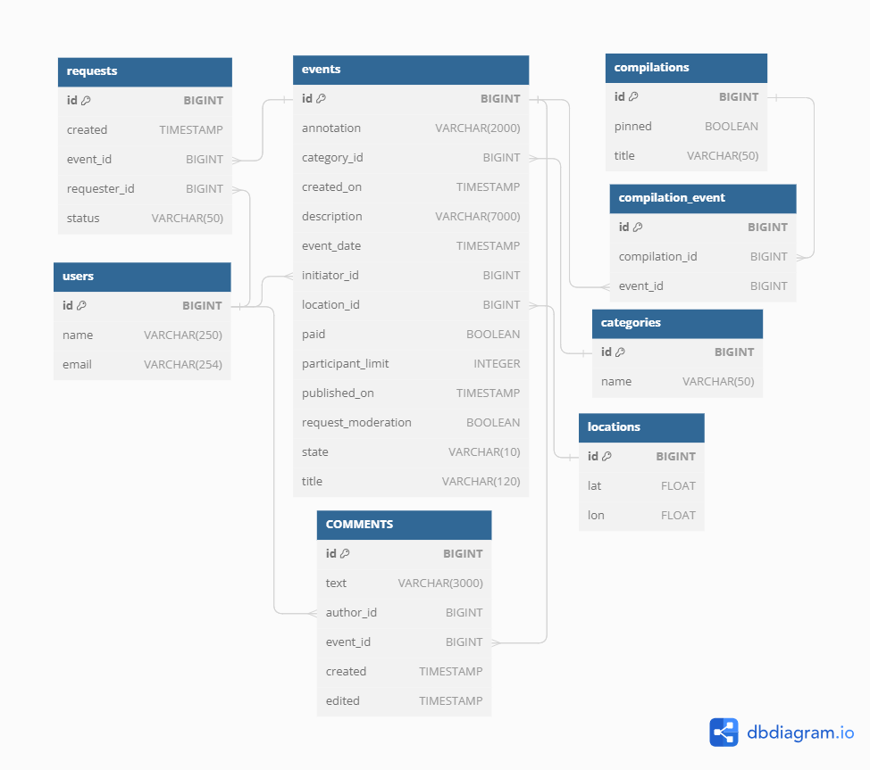
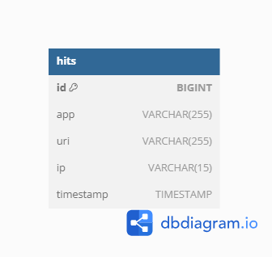

# Explore With Me
_В рамках дипломного проекта реализовано приложение, представляющее из себя афишу, в которой пользователи могут предлагать мероприятия и собирать компанию для участия в них._

## Используемые технологии:
* Java 11
* REST API
* Spring Boot
* Maven
* микросервисы, Docker
* PostgreSQL
* JPA, Hibernate
* Lombok
* Postman

## Приложение включает в себя несколько модулей:
* GateWay (не включен в проект, разрабатывается отдельно) - проверяет права пользователей и передает запросы на остальные микросервисы;
* Основной сервис — содержит всё необходимое для работы;
* Сервис статистики — хранит количество просмотров и позволяет делать различные выборки для анализа работы приложения.

## Сервис статистики состоит из трех модулей
* Модуль клиента сервиса статистики - HTTP-клиент на основе RestTemplate, который отправляет запросы и обрабатывает ответы;
* Модуль сервиса статистики, который содержит API с эндпойнтами для сохранения и формирования данных по запросу;
* Модуль общих ДТО.

## API oсновного сервиса состоит из 3-х частей:
1. Публичная (доступна без регистрации для всех пользователей)
* API для работы с событиями
* API для работы с категориями
* API для работы с подборками событий
* API для работы с комментариями
2. Приватная (доступна только для авторизированных пользователей)
* API для работы с событиями
* API для работы с запросами текущего пользователя на участие в событиях
* API для работы с комментариями
3. Административная (доступна только для администраторов сервиса)
* API для работы с событиями
* API для работы с категориями
* API для работы с пользователями
* API для работы с подборками событий
* API для работы с комментариями

## Спецификация Swagger для API:
[Основной сервис](https://github.com/ValentinaBuddha/java-explore-with-me/blob/main/ewm-main-service-spec.json)  
[Сервис статистики](https://github.com/ValentinaBuddha/java-explore-with-me/blob/main/ewm-stats-service-spec.json)

## Postman тесты для сервисов:
[Основной сервис](https://github.com/ValentinaBuddha/java-explore-with-me/blob/main/postman/main.json)  
[Сервис статистики](https://github.com/ValentinaBuddha/java-explore-with-me/blob/main/postman/stat.json)  
[Функциональность комментирования](https://github.com/ValentinaBuddha/java-explore-with-me/blob/main/postman/feature.json)

## Модель базы данных основного сервиса

## Модель базы данных сервиса статистики

## Иструкция по развертыванию
* mvn clean package
* mvn install
* docker-compose build
* docker-compose up -d
* основной сервис: http://localhost:8080
* сервис статистики: http://localhost:9090

## Планы по доработке проекта:
* Покрыть проект тестами
* Реализовать возможность подписываться на других пользователей и получать список актуальных событий, опубликованных этими пользователями.
* Реализовать подписку на друзей и возможность получать список актуальных событий, в которых они принимают участие.
* Реализовать возможность ставить лайк/дизлайк событию. Формирование рейтинга мероприятий и рейтинга их авторов. Возможность сортировки событий в зависимости от рейтингов. 	
* Реализовать возможность для администратора добавлять конкретные локации — города, театры, концертные залы и другие в виде координат (широта, долгота, радиус). Получение списка этих локаций. Возможность поиска событий в конкретной локации.
* Улучшение модерации событий администратором — возможность выгружать все события, ожидающие модерации, делать их проверку, а также оставлять комментарий для инициатора события, если оно не прошло модерацию. При этом у инициатора есть возможность исправить замечания и отправить событие на повторную модерацию.

